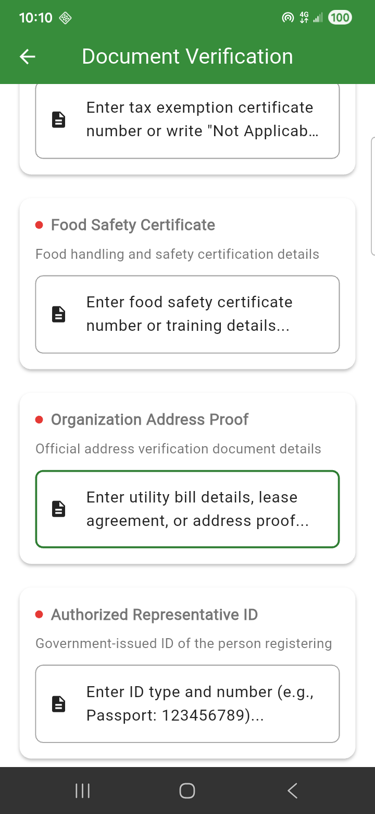

# Food Redistribution App (Flutter)

Flutter application for coordinating food donations between **Donors**, **NGOs**, and **Volunteers**, with an **Admin** flow for reviewing verification submissions.

## What’s in this repo (high-level)

- **Flutter app code**: `lib/`
- **Role-based screens**: `lib/screens/` (auth, donor, ngo, volunteer, admin, etc.)
- **Firebase-backed services**: `lib/services/` (auth, verification, notifications, etc.)
- **Assets**: `assets/` (images, icons, screenshots)
- **Docs (plain text)**: `docs/` (`README_FIRST.txt`, `STRUCTURE.txt`, `CLEAN_GIT_ONCE.txt`)

## Prerequisites

- Flutter SDK (Dart SDK \(>= 3.0.0 < 4.0.0\), see `pubspec.yaml`)
- A configured Firebase project if you want auth / Firestore / storage features to work

## Run locally

From the `food_redistribution_app/` folder:

```bash
flutter pub get
flutter run
```

## Firebase setup (required for auth / Firestore / storage)

This repo intentionally ignores machine-specific Firebase files (see `.gitignore`), so you usually need to generate/add these locally:

- **FlutterFire options**: `lib/firebase_options.dart`
- **Android**: `android/app/google-services.json`
- **iOS**: `ios/Runner/GoogleService-Info.plist`

If you use FlutterFire, generate `lib/firebase_options.dart` with the FlutterFire CLI (or add your own file with the same symbol used in `lib/main.dart`: `DefaultFirebaseOptions.currentPlatform`).

## Verification flow (example)

Document verification is implemented via `lib/services/verification_service.dart` and role screens, including:

- **Donor document upload + submit**: `lib/screens/donor/donor_verification_screen.dart`
- **Verification status UI** (example screenshot): `assets/screenshots/flutter_04.png` (shows “Verification in Progress”)
- **Admin review** updates `verifications` + user onboarding state (see `VerificationService.reviewSubmission`)

Screenshot (from `assets/screenshots/flutter_04.png`):



## Useful commands

From `food_redistribution_app/`:

```bash
flutter analyze
flutter test
```

Matching algorithm simulation:

```bash
dart run scripts/test_matching.dart
```

Optional menu-driven test runner:

- Windows: `scripts/run_tests.bat`
- macOS/Linux: `scripts/run_tests.sh`

## Project structure map

See `docs/STRUCTURE.txt` for a concise folder-by-folder guide.

